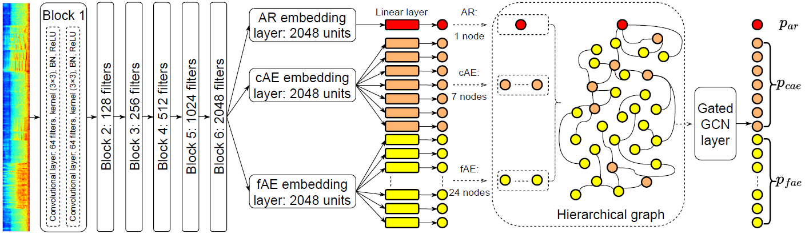

#  Hierarchical graph representation learning (HGRL)

<h3 align="center"> The proposed hierarchical graph representation learning (HGRL) with fAE-cAE-AR (fcAR) graph. <p></p></h3>
<div align="center">
 
</div>  

# Citation
Please feel free to use the method and consider citing our paper as
```bibtex
waiting....
```

# Run the model

```1) Unzip the Dataset.zip.001 ~ Dataset.zip.012 under the application folder```

```2) Unzip the pretrained_models.zip.001 ~ pretrained_models.zip.037 under the application folder```

```3) Enter the application folder: cd application```

## Start inference and evaluate the model

### 1) DNN
```python 
python inference.py -model DNN 
```
```python
Loading data time: 0.395 s
Split development data to 2200 training and 245 validation data and 445 test data.
Number of 445 audios in testing
ARP:
        mse_loss: 1.7334889331245231,  mae_loss: 1.0105259865535778, r2: 0.10527990628586636
AEC:
        Acc:  0.9048689138576779
```
 
### 2) CNN
```python 
python inference.py -model CNN 
```
```python
Loading data time: 0.346 s
Split development data to 2200 training and 245 validation data and 445 test data.
Number of 445 audios in testing
ARP:
        mse_loss: 1.6749440582583413,  mae_loss: 0.9967529329128479, r2: 0.13549716059065042
AEC:
        Acc:  0.9074906367041199
```

### 3) CNN-Transformer
```python 
python inference.py -model CNN_Transformer 
```
```python
Loading data time: 0.401 s
Split development data to 2200 training and 245 validation data and 445 test data.
Number of 445 audios in testing
ARP:
        mse_loss: 1.4451657348827343,  mae_loss: 0.9664605942522541, r2: 0.25409456210595127
AEC:
        Acc:  0.8894194756554307
```
 
### 4) PANN-Fixed
```python 
python inference.py -model PANN_fixed 
```
```python
Loading data time: 0.388 s
Split development data to 2200 training and 245 validation data and 445 test data.
Number of 445 audios in testing
ARP:
        mse_loss: 1.2619049372729334,  mae_loss: 0.8799253472853243, r2: 0.3486824852696866
AEC:
        Acc:  0.9105805243445693
```

### 5) PANN-Fine-tuning
```python 
python inference.py -model PANN_fine_tuning 
```
```python
Loading data time: 0.392 s
Split development data to 2200 training and 245 validation data and 445 test data.
Number of 445 audios in testing
ARP:
        mse_loss: 1.162030314619814,  mae_loss: 0.8582522204431255, r2: 0.4002316068315971
AEC:
        Acc:  0.9188202247191011
```

### 6) HGRL
```python 
python inference.py -model HGRL 
```
```python
Loading data time: 0.613 s
Split development data to 2200 training and 245 validation data and 445 test data.
Number of 445 audios in testing
ARP:
        mse_loss: 1.0493635489891715,  mae_loss: 0.8028289986728283, r2: 0.45838324378599105
AEC:
        Acc:  0.9171348314606742
```

# Modification and Training

If you want to modify the model structure, please modify it in the models_pytorch.py file under the framework folder.

If you want to retrain these models, the data loader and model definition are ready, you only need to refer to the common Pytorch training process to complete your own training script.


